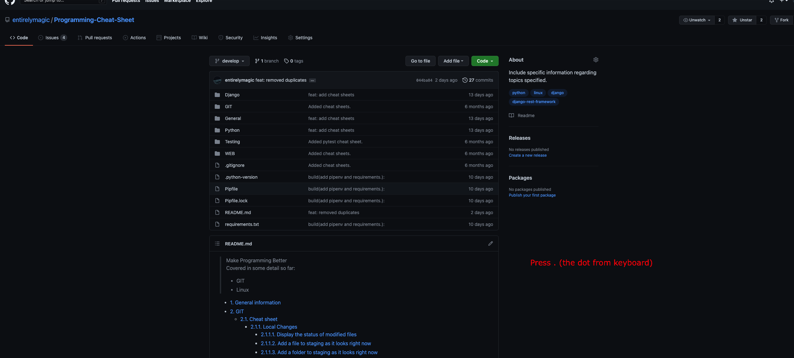
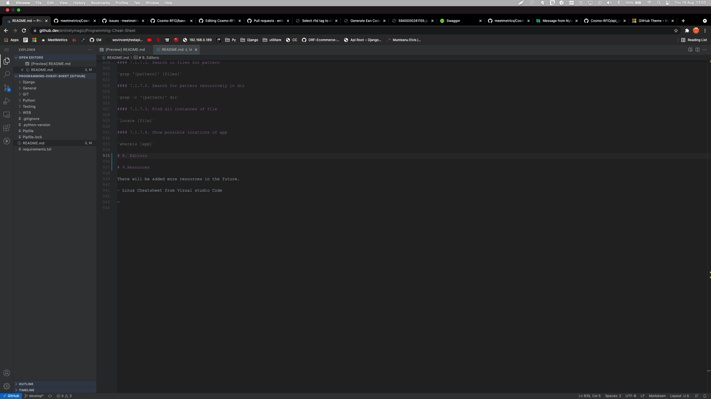
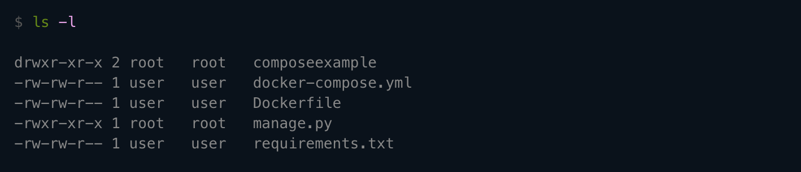

> Partially covered:
>
> - Django
> - Python
> - Docker
> - GIT
> - Linux
>
- [1. General information](#1-general-information)
  - [1.1. Create a VS Code Editor from web (press `.` o open when on main Repository page)](#11-create-a-vs-code-editor-from-web-press--o-open-when-on-main-repository-page)
- [2. GIT](#2-git)
  - [2.1. Cheat sheet](#21-cheat-sheet)
    - [2.1.1. Local Changes](#211-local-changes)
      - [2.1.1.1. Create a git patch from the uncommitted changes in the current working directory](#2111-create-a-git-patch-from-the-uncommitted-changes-in-the-current-working-directory)
      - [2.1.1.2. Display the status of modified files](#2112-display-the-status-of-modified-files)
      - [2.1.1.3. Add a file to staging as it looks right now](#2113-add-a-file-to-staging-as-it-looks-right-now)
      - [2.1.1.4. Add a folder to staging as it looks right now](#2114-add-a-folder-to-staging-as-it-looks-right-now)
      - [2.1.1.5. Commit staged files in a new commit](#2115-commit-staged-files-in-a-new-commit)
      - [2.1.1.6. Add all files to staging and commit them at once](#2116-add-all-files-to-staging-and-commit-them-at-once)
      - [2.1.1.7. Unstage a file while retaining the changes](#2117-unstage-a-file-while-retaining-the-changes)
      - [2.1.1.8. Diff of what is changed but not staged](#2118-diff-of-what-is-changed-but-not-staged)
      - [2.1.1.9. Diff of what has changed between staged changes and the last commit](#2119-diff-of-what-has-changed-between-staged-changes-and-the-last-commit)
    - [2.1.2. Branches](#212-branches)
      - [2.1.2.1. List all branches. The current one is marked with *](#2121-list-all-branches-the-current-one-is-marked-with-)
      - [2.1.2.2. Create a new branch](#2122-create-a-new-branch)
      - [2.1.2.3. Switch to a branch](#2123-switch-to-a-branch)
      - [2.1.2.4. Create a new branch and switch to it](#2124-create-a-new-branch-and-switch-to-it)
      - [2.1.2.5. Switch to the previously checked out branch](#2125-switch-to-the-previously-checked-out-branch)
      - [2.1.2.6. Rename a branch](#2126-rename-a-branch)
      - [2.1.2.7. Delete a branch, locally](#2127-delete-a-branch-locally)
      - [2.1.2.8. Merge another branch into the current one](#2128-merge-another-branch-into-the-current-one)
    - [2.1.3. Working with a Remote Repository](#213-working-with-a-remote-repository)
      - [2.1.3.1. Fetch and merge all commits from the tracked remote branch](#2131-fetch-and-merge-all-commits-from-the-tracked-remote-branch)
      - [2.1.3.2. Fetch and merge all commits from a specific remote branch](#2132-fetch-and-merge-all-commits-from-a-specific-remote-branch)
      - [2.1.3.3. Fetch recent changes from the tracked remote branch but don't merge them](#2133-fetch-recent-changes-from-the-tracked-remote-branch-but-dont-merge-them)
      - [2.1.3.4. Push all local branch commits to the tracked remote branch](#2134-push-all-local-branch-commits-to-the-tracked-remote-branch)
      - [2.1.3.5. Push all local branch commits to a specific remote branch](#2135-push-all-local-branch-commits-to-a-specific-remote-branch)
      - [2.1.3.6. Add a new remote repository with the given alias](#2136-add-a-new-remote-repository-with-the-given-alias)
      - [2.1.3.7. Display a list of remote repositories and their URLs](#2137-display-a-list-of-remote-repositories-and-their-urls)
    - [2.1.4. Commit History](#214-commit-history)
      - [2.1.4.1. Show all commits in the current branch’s history](#2141-show-all-commits-in-the-current-branchs-history)
      - [2.1.4.2. Show all commits in the current branch’s history by printing each commit on a single line](#2142-show-all-commits-in-the-current-branchs-history-by-printing-each-commit-on-a-single-line)
      - [2.1.4.3. Show number of commits per author on all branches, excluding merge commits](#2143-show-number-of-commits-per-author-on-all-branches-excluding-merge-commits)
      - [2.1.4.4. Show number of commits per author on a branch, excluding merge commits](#2144-show-number-of-commits-per-author-on-a-branch-excluding-merge-commits)
      - [2.1.4.5. Show number of commits per author on all branches, including merge commits](#2145-show-number-of-commits-per-author-on-all-branches-including-merge-commits)
      - [2.1.4.6. Show number of commits per author on a branch, including merge commits](#2146-show-number-of-commits-per-author-on-a-branch-including-merge-commits)
    - [2.1.5. Rebase](#215-rebase)
      - [2.1.5.1. Reapply commits from the current branch on top of another base](#2151-reapply-commits-from-the-current-branch-on-top-of-another-base)
      - [2.1.5.2. Abort a rebase](#2152-abort-a-rebase)
      - [2.1.5.3. Continue a rebase after resolving conflicts](#2153-continue-a-rebase-after-resolving-conflicts)
    - [2.1.6. Undo](#216-undo)
      - [2.1.6.1. Revert the changes in a commit and record them in a new commit](#2161-revert-the-changes-in-a-commit-and-record-them-in-a-new-commit)
      - [2.1.6.2. Reset to a previous commit and preserve the changes made since [commit] as unstaged](#2162-reset-to-a-previous-commit-and-preserve-the-changes-made-since-commit-as-unstaged)
      - [2.1.6.3. Reset to a previous commit and discard the changes made since the [commit]](#2163-reset-to-a-previous-commit-and-discard-the-changes-made-since-the-commit)
    - [2.1.7. Stash](#217-stash)
      - [2.1.7.1. Stash modified and staged changes](#2171-stash-modified-and-staged-changes)
      - [2.1.7.2. Stash modified and staged changes with a custom message](#2172-stash-modified-and-staged-changes-with-a-custom-message)
      - [2.1.7.3. Stash a selected file by specifying a path](#2173-stash-a-selected-file-by-specifying-a-path)
      - [2.1.7.4. List all stashed changesets](#2174-list-all-stashed-changesets)
      - [2.1.7.5. Restore the most recently stashed changeset and delete it](#2175-restore-the-most-recently-stashed-changeset-and-delete-it)
      - [2.1.7.6. Delete the most recently stashed changeset](#2176-delete-the-most-recently-stashed-changeset)
    - [2.1.8. Tags](#218-tags)
      - [2.1.8.1. Create a new tag](#2181-create-a-new-tag)
      - [2.1.8.2. List all tags](#2182-list-all-tags)
      - [2.1.8.3. Delete a tag](#2183-delete-a-tag)
    - [2.1.9. Repository Setup](#219-repository-setup)
      - [2.1.9.1. Create an empty repository in the current folder](#2191-create-an-empty-repository-in-the-current-folder)
      - [2.1.9.2. Create an empty repository in a specific folder](#2192-create-an-empty-repository-in-a-specific-folder)
      - [2.1.9.3. Clone a repository and add it to the current folder](#2193-clone-a-repository-and-add-it-to-the-current-folder)
      - [2.1.9.4. Clone a repository to a specific folder](#2194-clone-a-repository-to-a-specific-folder)
    - [2.1.10. Global Config](#2110-global-config)
      - [2.1.10.1. Set the username](#21101-set-the-username)
      - [2.1.10.2. Set the user email](#21102-set-the-user-email)
      - [2.1.10.3. Set automatic command line coloring](#21103-set-automatic-command-line-coloring)
  - [2.2. RE-clone](#22-re-clone)
  - [2.3. Clean and reset](#23-clean-and-reset)
  - [2.4. Clean](#24-clean)
  - [2.5. Reset](#25-reset)
  - [2.6. Update local branch after main branch was renamed](#26-update-local-branch-after-main-branch-was-renamed)
  - [2.7 Git LFS (Large File Storage)](#27-git-lfs-large-file-storage)
    - [Include in the current project files from the previews pushes of files that became larger then 100MB](#include-in-the-current-project-files-from-the-previews-pushes-of-files-that-became-larger-then-100mb)
- [3. Python](#3-python)
  - [3.1. Cheat Sheets](#31-cheat-sheets)
  - [3.2. Data Types](#32-data-types)
    - [3.2.1. Text Type: `str`](#321-text-type-str)
    - [3.2.2. Numeric Types: `int`, `float`, `complex`](#322-numeric-types-int-float-complex)
    - [3.2.3. Sequence Types: `list`, `tuple`, `range`](#323-sequence-types-list-tuple-range)
      - [3.2.3.1. List](#3231-list)
        - [3.2.3.1.1. Transform a nested list into a simple list](#32311-transform-a-nested-list-into-a-simple-list)
    - [3.2.4. Mapping Type: `dict`](#324-mapping-type-dict)
    - [3.2.5. Set Types: `set`, `frozenset`](#325-set-types-set-frozenset)
    - [3.2.6. Boolean Type: `bool`](#326-boolean-type-bool)
    - [3.2.7. Binary Types: `bytes`, `bytearray`, `memoryview`](#327-binary-types-bytes-bytearray-memoryview)
  - [3.3. Useful Functions](#33-useful-functions)
    - [3.3.1. EAN generators](#331-ean-generators)
    - [3.3.2. 3.2.2 XLSX Generators](#332-322-xlsx-generators)
  - [3.4. Asynchronous Python](#34-asynchronous-python)
    - [3.4.1. Asynchronous Web Socket Class](#341-asynchronous-web-socket-class)
- [4. Django](#4-django)
  - [4.1. Cheat Sheet](#41-cheat-sheet)
  - [4.2. Django Extensions](#42-django-extensions)
  - [4.3. Authentication](#43-authentication)
  - [4.4. User registration](#44-user-registration)
  - [4.5. Models](#45-models)
    - [4.5.1. Implementing rules to Django models](#451-implementing-rules-to-django-models)
      - [4.5.1.1. Redirect](#4511-redirect)
  - [4.6. Views](#46-views)
    - [4.6.1. API views](#461-api-views)
      - [4.6.1.1. Redirect](#4611-redirect)
      - [4.6.1.2. Make a view accept single or multiple posts to database](#4612-make-a-view-accept-single-or-multiple-posts-to-database)
  - [4.7. Django Testing](#47-django-testing)
    - [4.7.1. Coverage](#471-coverage)
  - [4.8. Django 3.1 Async](#48-django-31-async)
  - [4.9. Using with Docker](#49-using-with-docker)
- [5. SQL](#5-sql)
- [6. Web](#6-web)
- [7. Operating Systems](#7-operating-systems)
  - [7.1. Linux](#71-linux)
    - [7.1.1. Files and Navigating](#711-files-and-navigating)
      - [7.1.1.1. Directory listening](#7111-directory-listening)
      - [7.1.1.2. Formatted listening](#7112-formatted-listening)
      - [7.1.1.3. Formatted listening including hidden files](#7113-formatted-listening-including-hidden-files)
      - [7.1.1.4. Change directory](#7114-change-directory)
      - [7.1.1.5. Change to parent directory](#7115-change-to-parent-directory)
      - [7.1.1.6. Show the path where actually you are](#7116-show-the-path-where-actually-you-are)
      - [7.1.1.7. Create a directory](#7117-create-a-directory)
      - [7.1.1.8. Remove directory](#7118-remove-directory)
      - [7.1.1.9. Force remove](#7119-force-remove)
      - [7.1.1.10. file](#71110-file)
      - [7.1.1.11. Rename or move file](#71111-rename-or-move-file)
      - [7.1.1.12. Create file](#71112-create-file)
      - [7.1.1.13. Output contents of file](#71113-output-contents-of-file)
      - [7.1.1.14. Write standard input into file](#71114-write-standard-input-into-file)
      - [7.1.1.15. Append standard input into file](#71115-append-standard-input-into-file)
      - [7.1.1.16. Output contents of file it grows](#71116-output-contents-of-file-it-grows)
    - [7.1.2. Networking](#712-networking)
      - [7.1.2.1. Ping host](#7121-ping-host)
      - [7.1.2.2. Show the actually routing table](#7122-show-the-actually-routing-table)
      - [7.1.2.3. Check your iptable's rules](#7123-check-your-iptables-rules)
      - [7.1.2.4. List all ports](#7124-list-all-ports)
      - [7.1.2.5. Got whois for domain](#7125-got-whois-for-domain)
      - [7.1.2.6. Get DNS for domain](#7126-get-dns-for-domain)
      - [7.1.2.7. Reserve lookup host](#7127-reserve-lookup-host)
      - [7.1.2.8. Download file](#7128-download-file)
      - [7.1.2.9. Recursively download files from url](#7129-recursively-download-files-from-url)
      - [7.1.2.10. Outputs the webpage from url](#71210-outputs-the-webpage-from-url)
      - [7.1.2.11. Connect to host as user](#71211-connect-to-host-as-user)
      - [7.1.2.12. Connect using port](#71212-connect-using-port)
      - [7.1.2.13. Connect and use bind port](#71213-connect-and-use-bind-port)
    - [7.1.3. Processes](#713-processes)
      - [7.1.3.1. Display currently active processes](#7131-display-currently-active-processes)
      - [7.1.3.2. Detailed outputs](#7132-detailed-outputs)
      - [7.1.3.3. Kill process with process id (pid)](#7133-kill-process-with-process-id-pid)
      - [7.1.3.4. Kill all processes named proc](#7134-kill-all-processes-named-proc)
    - [7.1.4. System Info](#714-system-info)
      - [7.1.4.1. Show current date/time](#7141-show-current-datetime)
      - [7.1.4.2. Show uptime](#7142-show-uptime)
      - [7.1.4.3. Who you're logged in as](#7143-who-youre-logged-in-as)
      - [7.1.4.4. Display who is online](#7144-display-who-is-online)
      - [7.1.4.5. Memory info](#7145-memory-info)
      - [7.1.4.6. Show memory and swap usage](#7146-show-memory-and-swap-usage)
      - [7.1.4.7. Show directory space usage](#7147-show-directory-space-usage)
      - [7.1.4.8. Displays readable size in GB](#7148-displays-readable-size-in-gb)
      - [7.1.4.9. Show disk usage](#7149-show-disk-usage)
      - [7.1.4.10. Show kernel config](#71410-show-kernel-config)
    - [7.1.5. Compressing](#715-compressing)
      - [7.1.5.1. Tar files into file.tar](#7151-tar-files-into-filetar)
      - [7.1.5.2. Untar into current directory](#7152-untar-into-current-directory)
      - [7.1.5.3. Show contents of archive](#7153-show-contents-of-archive)
    - [7.1.6. Permissions](#716-permissions)
      - [7.1.6.1. Change permissions of file](#7161-change-permissions-of-file)
    - [7.1.7. Others](#717-others)
      - [7.1.7.1. Search in files for pattern](#7171-search-in-files-for-pattern)
      - [7.1.7.2. Search for pattern recursively in dir](#7172-search-for-pattern-recursively-in-dir)
      - [7.1.7.3. Find all instances of file](#7173-find-all-instances-of-file)
      - [7.1.7.4. Show possible locations of app](#7174-show-possible-locations-of-app)
- [8. Editors](#8-editors)
- [9. Docker](#9-docker)
  - [9.1. Docker for Data Science](#91-docker-for-data-science)
  - [9.2. Docker Cheat Sheet](#92-docker-cheat-sheet)
    - [9.2.1. Create Containers without Starting](#921-create-containers-without-starting)
    - [9.2.2. Start a Container](#922-start-a-container)
    - [9.2.3. Inspect a Container](#923-inspect-a-container)
    - [9.2.4. Container Names](#924-container-names)
    - [9.2.5. Run Interactive command](#925-run-interactive-command)
    - [9.2.6. Port Mapping](#926-port-mapping)
    - [9.2.7. To stop all Docker containers, simply run the following command in your terminal](#927-to-stop-all-docker-containers-simply-run-the-following-command-in-your-terminal)
    - [9.2.8. If you don’t just want to stop containers and you’d like to go a step further and remove them, simply run the following command](#928-if-you-dont-just-want-to-stop-containers-and-youd-like-to-go-a-step-further-and-remove-them-simply-run-the-following-command)
    - [9.2.9. To remove all Docker images, run this command](#929-to-remove-all-docker-images-run-this-command)
    - [9.2.10. Bind Mount Host Folders](#9210-bind-mount-host-folders)
    - [9.2.11. List Containers](#9211-list-containers)
    - [9.2.12. Run Container in Background or Detached](#9212-run-container-in-background-or-detached)
    - [9.2.13. Attack to a Container](#9213-attack-to-a-container)
    - [9.2.14. Environment Variables in Container](#9214-environment-variables-in-container)
    - [9.2.15. Attach Commands in Running Container](#9215-attach-commands-in-running-container)
    - [9.2.16. Pull a Image](#9216-pull-a-image)
    - [9.2.17. Rename the image](#9217-rename-the-image)
    - [9.2.18. Print Container Logs](#9218-print-container-logs)
    - [9.2.19. Inspect Image Metadata](#9219-inspect-image-metadata)
  - [9.3. Create a Docker Image with example](#93-create-a-docker-image-with-example)
    - [9.3.1. DockerFile Format](#931-dockerfile-format)
      - [9.3.1.1. Filesystem Modification Instructions](#9311-filesystem-modification-instructions)
      - [9.3.1.2. Metadata Modification Instructions](#9312-metadata-modification-instructions)
    - [9.3.2. Docker Build Command](#932-docker-build-command)
    - [9.3.3. ARG instruction](#933-arg-instruction)
    - [9.3.4. Copy instructions](#934-copy-instructions)
      - [9.3.4.1. Copy and file ownership](#9341-copy-and-file-ownership)
    - [9.3.5. RUN instruction](#935-run-instruction)
    - [9.3.6. Volume Mount Points](#936-volume-mount-points)
    - [9.3.7. Docker Hub Push Image to Registry](#937-docker-hub-push-image-to-registry)
      - [9.3.7.1. Other Image Registries](#9371-other-image-registries)
- [10. SQL](#10-sql)
  - [10.1. POSGRESQL](#101-posgresql)
    - [10.1.1. Update a table that have a column with a null value with a value](#1011-update-a-table-that-have-a-column-with-a-null-value-with-a-value)
- [11. Resources](#11-resources)

  - [4.5. Models](#45-models)
    - [4.5.1. Implementing rules to Django models](#451-implementing-rules-to-django-models)
  - [4.6. Views](#46-views)
    - [4.6.1. API views](#461-api-views)
      - [4.6.1.1. Redirect](#4611-redirect)
  - [4.7. Django Testing](#47-django-testing)
    - [4.7.1. Coverage](#471-coverage)
  - [4.8. Django 3.1 Async](#48-django-31-async)
  - [4.9. Using with Docker](#49-using-with-docker)

- [1. General information](#1-general-information)
  - [1.1. Create a VS Code Editor from web (press `.` o open when on main Repository page)](#11-create-a-vs-code-editor-from-web-press--o-open-when-on-main-repository-page)
- [2. GIT](#2-git)
  - [2.1. Cheat sheet](#21-cheat-sheet)
    - [2.1.1. Local Changes](#211-local-changes)
      - [2.1.1.1. Create a git patch from the uncommitted changes in the current working directory](#2111-create-a-git-patch-from-the-uncommitted-changes-in-the-current-working-directory)
      - [2.1.1.2. Display the status of modified files](#2112-display-the-status-of-modified-files)
      - [2.1.1.3. Add a file to staging as it looks right now](#2113-add-a-file-to-staging-as-it-looks-right-now)
      - [2.1.1.4. Add a folder to staging as it looks right now](#2114-add-a-folder-to-staging-as-it-looks-right-now)
      - [2.1.1.5. Commit staged files in a new commit](#2115-commit-staged-files-in-a-new-commit)
      - [2.1.1.6. Add all files to staging and commit them at once](#2116-add-all-files-to-staging-and-commit-them-at-once)
      - [2.1.1.7. Unstage a file while retaining the changes](#2117-unstage-a-file-while-retaining-the-changes)
      - [2.1.1.8. Diff of what is changed but not staged](#2118-diff-of-what-is-changed-but-not-staged)
      - [2.1.1.9. Diff of what has changed between staged changes and the last commit](#2119-diff-of-what-has-changed-between-staged-changes-and-the-last-commit)
    - [2.1.2. Branches](#212-branches)
      - [2.1.2.1. List all branches. The current one is marked with *](#2121-list-all-branches-the-current-one-is-marked-with-)
      - [2.1.2.2. Create a new branch](#2122-create-a-new-branch)
      - [2.1.2.3. Switch to a branch](#2123-switch-to-a-branch)
      - [2.1.2.4. Create a new branch and switch to it](#2124-create-a-new-branch-and-switch-to-it)
      - [2.1.2.5. Switch to the previously checked out branch](#2125-switch-to-the-previously-checked-out-branch)
      - [2.1.2.6. Rename a branch](#2126-rename-a-branch)
      - [2.1.2.7. Delete a branch, locally](#2127-delete-a-branch-locally)
      - [2.1.2.8. Merge another branch into the current one](#2128-merge-another-branch-into-the-current-one)
    - [2.1.3. Working with a Remote Repository](#213-working-with-a-remote-repository)
      - [2.1.3.1. Fetch and merge all commits from the tracked remote branch](#2131-fetch-and-merge-all-commits-from-the-tracked-remote-branch)
      - [2.1.3.2. Fetch and merge all commits from a specific remote branch](#2132-fetch-and-merge-all-commits-from-a-specific-remote-branch)
      - [2.1.3.3. Fetch recent changes from the tracked remote branch but don't merge them](#2133-fetch-recent-changes-from-the-tracked-remote-branch-but-dont-merge-them)
      - [2.1.3.4. Push all local branch commits to the tracked remote branch](#2134-push-all-local-branch-commits-to-the-tracked-remote-branch)
      - [2.1.3.5. Push all local branch commits to a specific remote branch](#2135-push-all-local-branch-commits-to-a-specific-remote-branch)
      - [2.1.3.6. Add a new remote repository with the given alias](#2136-add-a-new-remote-repository-with-the-given-alias)
      - [2.1.3.7. Display a list of remote repositories and their URLs](#2137-display-a-list-of-remote-repositories-and-their-urls)
    - [2.1.4. Commit History](#214-commit-history)
      - [2.1.4.1. Show all commits in the current branch’s history](#2141-show-all-commits-in-the-current-branchs-history)
      - [2.1.4.2. Show all commits in the current branch’s history by printing each commit on a single line](#2142-show-all-commits-in-the-current-branchs-history-by-printing-each-commit-on-a-single-line)
      - [2.1.4.3. Show number of commits per author on all branches, excluding merge commits](#2143-show-number-of-commits-per-author-on-all-branches-excluding-merge-commits)
      - [2.1.4.4. Show number of commits per author on a branch, excluding merge commits](#2144-show-number-of-commits-per-author-on-a-branch-excluding-merge-commits)
      - [2.1.4.5. Show number of commits per author on all branches, including merge commits](#2145-show-number-of-commits-per-author-on-all-branches-including-merge-commits)
      - [2.1.4.6. Show number of commits per author on a branch, including merge commits](#2146-show-number-of-commits-per-author-on-a-branch-including-merge-commits)
    - [2.1.5. Rebase](#215-rebase)
      - [2.1.5.1. Reapply commits from the current branch on top of another base](#2151-reapply-commits-from-the-current-branch-on-top-of-another-base)
      - [2.1.5.2. Abort a rebase](#2152-abort-a-rebase)
      - [2.1.5.3. Continue a rebase after resolving conflicts](#2153-continue-a-rebase-after-resolving-conflicts)
    - [2.1.6. Undo](#216-undo)
      - [2.1.6.1. Revert the changes in a commit and record them in a new commit](#2161-revert-the-changes-in-a-commit-and-record-them-in-a-new-commit)
      - [2.1.6.2. Reset to a previous commit and preserve the changes made since [commit] as unstaged](#2162-reset-to-a-previous-commit-and-preserve-the-changes-made-since-commit-as-unstaged)
      - [2.1.6.3. Reset to a previous commit and discard the changes made since the [commit]](#2163-reset-to-a-previous-commit-and-discard-the-changes-made-since-the-commit)
    - [2.1.7. Stash](#217-stash)
      - [2.1.7.1. Stash modified and staged changes](#2171-stash-modified-and-staged-changes)
      - [2.1.7.2. Stash modified and staged changes with a custom message](#2172-stash-modified-and-staged-changes-with-a-custom-message)
      - [2.1.7.3. Stash a selected file by specifying a path](#2173-stash-a-selected-file-by-specifying-a-path)
      - [2.1.7.4. List all stashed changesets](#2174-list-all-stashed-changesets)
      - [2.1.7.5. Restore the most recently stashed changeset and delete it](#2175-restore-the-most-recently-stashed-changeset-and-delete-it)
      - [2.1.7.6. Delete the most recently stashed changeset](#2176-delete-the-most-recently-stashed-changeset)
    - [2.1.8. Tags](#218-tags)
      - [2.1.8.1. Create a new tag](#2181-create-a-new-tag)
      - [2.1.8.2. List all tags](#2182-list-all-tags)
      - [2.1.8.3. Delete a tag](#2183-delete-a-tag)
    - [2.1.9. Repository Setup](#219-repository-setup)
      - [2.1.9.1. Create an empty repository in the current folder](#2191-create-an-empty-repository-in-the-current-folder)
      - [2.1.9.2. Create an empty repository in a specific folder](#2192-create-an-empty-repository-in-a-specific-folder)
      - [2.1.9.3. Clone a repository and add it to the current folder](#2193-clone-a-repository-and-add-it-to-the-current-folder)
      - [2.1.9.4. Clone a repository to a specific folder](#2194-clone-a-repository-to-a-specific-folder)
    - [2.1.10. Global Config](#2110-global-config)
      - [2.1.10.1. Set the username](#21101-set-the-username)
      - [2.1.10.2. Set the user email](#21102-set-the-user-email)
      - [2.1.10.3. Set automatic command line coloring](#21103-set-automatic-command-line-coloring)
  - [2.2. RE-clone](#22-re-clone)
  - [2.3. Clean and reset](#23-clean-and-reset)
  - [2.4. Clean](#24-clean)
  - [2.5. Reset](#25-reset)
  - [2.6. Update local branch after main branch was renamed](#26-update-local-branch-after-main-branch-was-renamed)
  - [2.7 Git LFS (Large File Storage)](#27-git-lfs-large-file-storage)
    - [Include in the current project files from the previews pushes of files that became larger then 100MB](#include-in-the-current-project-files-from-the-previews-pushes-of-files-that-became-larger-then-100mb)
- [3. Python](#3-python)
  - [3.1. Cheat Sheets](#31-cheat-sheets)
  - [3.2. Data Types](#32-data-types)
    - [3.2.1. Text Type: `str`](#321-text-type-str)
    - [3.2.2. Numeric Types: `int`, `float`, `complex`](#322-numeric-types-int-float-complex)
    - [3.2.3. Sequence Types: `list`, `tuple`, `range`](#323-sequence-types-list-tuple-range)
      - [3.2.3.1. List](#3231-list)
        - [3.2.3.1.1. Transform a nested list into a simple list](#32311-transform-a-nested-list-into-a-simple-list)
    - [3.2.4. Mapping Type: `dict`](#324-mapping-type-dict)
    - [3.2.5. Set Types: `set`, `frozenset`](#325-set-types-set-frozenset)
    - [3.2.6. Boolean Type: `bool`](#326-boolean-type-bool)
    - [3.2.7. Binary Types: `bytes`, `bytearray`, `memoryview`](#327-binary-types-bytes-bytearray-memoryview)
  - [3.3. Useful Functions](#33-useful-functions)
    - [3.3.1. EAN generators](#331-ean-generators)
    - [3.3.2. 3.2.2 XLSX Generators](#332-322-xlsx-generators)
  - [3.4. Asynchronous Python](#34-asynchronous-python)
    - [3.4.1. Asynchronous Web Socket Class](#341-asynchronous-web-socket-class)
- [4. Django](#4-django)
  - [4.1. Cheat Sheet](#41-cheat-sheet)
  - [4.2. Django Extensions](#42-django-extensions)
  - [4.3. Authentication](#43-authentication)
  - [4.4. User registration](#44-user-registration)
  - [4.5. Models](#45-models)
    - [4.5.1. Implementing rules to Django models](#451-implementing-rules-to-django-models)
      - [4.5.1.1. Redirect](#4511-redirect)
  - [4.6. Views](#46-views)
    - [4.6.1. API views](#461-api-views)
      - [4.6.1.1. Redirect](#4611-redirect)
      - [4.6.1.2. Make a view accept single or multiple posts to database](#4612-make-a-view-accept-single-or-multiple-posts-to-database)
  - [4.7. Django Testing](#47-django-testing)
    - [4.7.1. Coverage](#471-coverage)
  - [4.8. Django 3.1 Async](#48-django-31-async)
  - [4.9. Using with Docker](#49-using-with-docker)
- [5. SQL](#5-sql)
- [6. Web](#6-web)
- [7. Operating Systems](#7-operating-systems)
  - [7.1. Linux](#71-linux)
    - [7.1.1. Files and Navigating](#711-files-and-navigating)
      - [7.1.1.1. Directory listening](#7111-directory-listening)
      - [7.1.1.2. Formatted listening](#7112-formatted-listening)
      - [7.1.1.3. Formatted listening including hidden files](#7113-formatted-listening-including-hidden-files)
      - [7.1.1.4. Change directory](#7114-change-directory)
      - [7.1.1.5. Change to parent directory](#7115-change-to-parent-directory)
      - [7.1.1.6. Show the path where actually you are](#7116-show-the-path-where-actually-you-are)
      - [7.1.1.7. Create a directory](#7117-create-a-directory)
      - [7.1.1.8. Remove directory](#7118-remove-directory)
      - [7.1.1.9. Force remove](#7119-force-remove)
      - [7.1.1.10. file](#71110-file)
      - [7.1.1.11. Rename or move file](#71111-rename-or-move-file)
      - [7.1.1.12. Create file](#71112-create-file)
      - [7.1.1.13. Output contents of file](#71113-output-contents-of-file)
      - [7.1.1.14. Write standard input into file](#71114-write-standard-input-into-file)
      - [7.1.1.15. Append standard input into file](#71115-append-standard-input-into-file)
      - [7.1.1.16. Output contents of file it grows](#71116-output-contents-of-file-it-grows)
    - [7.1.2. Networking](#712-networking)
      - [7.1.2.1. Ping host](#7121-ping-host)
      - [7.1.2.2. Show the actually routing table](#7122-show-the-actually-routing-table)
      - [7.1.2.3. Check your iptable's rules](#7123-check-your-iptables-rules)
      - [7.1.2.4. List all ports](#7124-list-all-ports)
      - [7.1.2.5. Got whois for domain](#7125-got-whois-for-domain)
      - [7.1.2.6. Get DNS for domain](#7126-get-dns-for-domain)
      - [7.1.2.7. Reserve lookup host](#7127-reserve-lookup-host)
      - [7.1.2.8. Download file](#7128-download-file)
      - [7.1.2.9. Recursively download files from url](#7129-recursively-download-files-from-url)
      - [7.1.2.10. Outputs the webpage from url](#71210-outputs-the-webpage-from-url)
      - [7.1.2.11. Connect to host as user](#71211-connect-to-host-as-user)
      - [7.1.2.12. Connect using port](#71212-connect-using-port)
      - [7.1.2.13. Connect and use bind port](#71213-connect-and-use-bind-port)
    - [7.1.3. Processes](#713-processes)
      - [7.1.3.1. Display currently active processes](#7131-display-currently-active-processes)
      - [7.1.3.2. Detailed outputs](#7132-detailed-outputs)
      - [7.1.3.3. Kill process with process id (pid)](#7133-kill-process-with-process-id-pid)
      - [7.1.3.4. Kill all processes named proc](#7134-kill-all-processes-named-proc)
    - [7.1.4. System Info](#714-system-info)
      - [7.1.4.1. Show current date/time](#7141-show-current-datetime)
      - [7.1.4.2. Show uptime](#7142-show-uptime)
      - [7.1.4.3. Who you're logged in as](#7143-who-youre-logged-in-as)
      - [7.1.4.4. Display who is online](#7144-display-who-is-online)
      - [7.1.4.5. Memory info](#7145-memory-info)
      - [7.1.4.6. Show memory and swap usage](#7146-show-memory-and-swap-usage)
      - [7.1.4.7. Show directory space usage](#7147-show-directory-space-usage)
      - [7.1.4.8. Displays readable size in GB](#7148-displays-readable-size-in-gb)
      - [7.1.4.9. Show disk usage](#7149-show-disk-usage)
      - [7.1.4.10. Show kernel config](#71410-show-kernel-config)
    - [7.1.5. Compressing](#715-compressing)
      - [7.1.5.1. Tar files into file.tar](#7151-tar-files-into-filetar)
      - [7.1.5.2. Untar into current directory](#7152-untar-into-current-directory)
      - [7.1.5.3. Show contents of archive](#7153-show-contents-of-archive)
    - [7.1.6. Permissions](#716-permissions)
      - [7.1.6.1. Change permissions of file](#7161-change-permissions-of-file)
    - [7.1.7. Others](#717-others)
      - [7.1.7.1. Search in files for pattern](#7171-search-in-files-for-pattern)
      - [7.1.7.2. Search for pattern recursively in dir](#7172-search-for-pattern-recursively-in-dir)
      - [7.1.7.3. Find all instances of file](#7173-find-all-instances-of-file)
      - [7.1.7.4. Show possible locations of app](#7174-show-possible-locations-of-app)
- [8. Editors](#8-editors)
- [9. Docker](#9-docker)
  - [9.1. Docker for Data Science](#91-docker-for-data-science)
  - [9.2. Docker Cheat Sheet](#92-docker-cheat-sheet)
    - [9.2.1. Create Containers without Starting](#921-create-containers-without-starting)
    - [9.2.2. Start a Container](#922-start-a-container)
    - [9.2.3. Inspect a Container](#923-inspect-a-container)
    - [9.2.4. Container Names](#924-container-names)
    - [9.2.5. Run Interactive command](#925-run-interactive-command)
    - [9.2.6. Port Mapping](#926-port-mapping)
    - [9.2.7. To stop all Docker containers, simply run the following command in your terminal](#927-to-stop-all-docker-containers-simply-run-the-following-command-in-your-terminal)
    - [9.2.8. If you don’t just want to stop containers and you’d like to go a step further and remove them, simply run the following command](#928-if-you-dont-just-want-to-stop-containers-and-youd-like-to-go-a-step-further-and-remove-them-simply-run-the-following-command)
    - [9.2.9. To remove all Docker images, run this command](#929-to-remove-all-docker-images-run-this-command)
    - [9.2.10. Bind Mount Host Folders](#9210-bind-mount-host-folders)
    - [9.2.11. List Containers](#9211-list-containers)
    - [9.2.12. Run Container in Background or Detached](#9212-run-container-in-background-or-detached)
    - [9.2.13. Attack to a Container](#9213-attack-to-a-container)
    - [9.2.14. Environment Variables in Container](#9214-environment-variables-in-container)
    - [9.2.15. Attach Commands in Running Container](#9215-attach-commands-in-running-container)
    - [9.2.16. Pull a Image](#9216-pull-a-image)
    - [9.2.17. Rename the image](#9217-rename-the-image)
    - [9.2.18. Print Container Logs](#9218-print-container-logs)
    - [9.2.19. Inspect Image Metadata](#9219-inspect-image-metadata)
  - [9.3. Create a Docker Image with example](#93-create-a-docker-image-with-example)
    - [9.3.1. DockerFile Format](#931-dockerfile-format)
      - [9.3.1.1. Filesystem Modification Instructions](#9311-filesystem-modification-instructions)
      - [9.3.1.2. Metadata Modification Instructions](#9312-metadata-modification-instructions)
    - [9.3.2. Docker Build Command](#932-docker-build-command)
    - [9.3.3. ARG instruction](#933-arg-instruction)
    - [9.3.4. Copy instructions](#934-copy-instructions)
      - [9.3.4.1. Copy and file ownership](#9341-copy-and-file-ownership)
    - [9.3.5. RUN instruction](#935-run-instruction)
    - [9.3.6. Volume Mount Points](#936-volume-mount-points)
    - [9.3.7. Docker Hub Push Image to Registry](#937-docker-hub-push-image-to-registry)
      - [9.3.7.1. Other Image Registries](#9371-other-image-registries)
- [10. SQL](#10-sql)
  - [10.1. POSGRESQL](#101-posgresql)
    - [10.1.1. Update a table that have a column with a null value with a value](#1011-update-a-table-that-have-a-column-with-a-null-value-with-a-value)
- [11. Resources](#11-resources)

# 1. General information

## 1.1. Create a VS Code Editor from web (press `.` o open when on main Repository page)

**Bellow are example of how to create a vscode editor from web.
IF you connect your account and synchronize it will load your settings.**



# 2. GIT

## 2.1. Cheat sheet

### 2.1.1. Local Changes

#### 2.1.1.1. Create a git patch from the uncommitted changes in the current working directory

If you haven't yet committed the changes, then:

`git diff > mypatch.patch`
But sometimes it happens that part of the stuff you're doing are new files that are untracked and won't be in your git diff output. So, one way to do a patch is to stage everything for a new commit (`git add each file`, or just `git add .`) but don't do the commit, and then:

`git diff --cached > mypatch.patch`
Add the 'binary' option if you want to add binary files to the patch (e.g. mp3 files):

`git diff --cached --binary > mypatch.patch`
You can later apply the patch:

`git apply mypatch.patch`

#### 2.1.1.2. Display the status of modified files

`git status`

#### 2.1.1.3. Add a file to staging as it looks right now

`git add [file_name]`

#### 2.1.1.4. Add a folder to staging as it looks right now

`git add [folder_name]`

#### 2.1.1.5. Commit staged files in a new commit

`git commit -m "descriptive_message"`

#### 2.1.1.6. Add all files to staging and commit them at once

`git commit -am "descriptive_message"`

#### 2.1.1.7. Unstage a file while retaining the changes

`git reset [file_name]`

#### 2.1.1.8. Diff of what is changed but not staged

`git diff`

#### 2.1.1.9. Diff of what has changed between staged changes and the last commit

`git diff --staged`

### 2.1.2. Branches

#### 2.1.2.1. List all branches. The current one is marked with *

`git branch`

#### 2.1.2.2. Create a new branch

`git branch [branch_name]`

#### 2.1.2.3. Switch to a branch

`git checkout [branch_name]`

#### 2.1.2.4. Create a new branch and switch to it

`git checkout -b [branch_name]`

#### 2.1.2.5. Switch to the previously checked out branch

`git checkout -`

#### 2.1.2.6. Rename a branch

`git checkout -m [new_branch]`

#### 2.1.2.7. Delete a branch, locally

`git branch -d [branch_name]`

#### 2.1.2.8. Merge another branch into the current one

`git merge [branch_name]`

### 2.1.3. Working with a Remote Repository

#### 2.1.3.1. Fetch and merge all commits from the tracked remote branch

`git pull`

#### 2.1.3.2. Fetch and merge all commits from a specific remote branch

`git pull [alias] [branch_name]`

#### 2.1.3.3. Fetch recent changes from the tracked remote branch but don't merge them

`git fetch`

#### 2.1.3.4. Push all local branch commits to the tracked remote branch

`git push`

#### 2.1.3.5. Push all local branch commits to a specific remote branch

`git push [alias] [branch_name]`

#### 2.1.3.6. Add a new remote repository with the given alias

`git remote add [alias] [repo_url]`

#### 2.1.3.7. Display a list of remote repositories and their URLs

`git remote -v`

### 2.1.4. Commit History

#### 2.1.4.1. Show all commits in the current branch’s history

`git log`

#### 2.1.4.2. Show all commits in the current branch’s history by printing each commit on a single line

`git log --oneline`

#### 2.1.4.3. Show number of commits per author on all branches, excluding merge commits

`git shortlog -s -n --all --no-merges`

#### 2.1.4.4. Show number of commits per author on a branch, excluding merge commits

`git shortlog -s -n [branch_name] --no-merges`

#### 2.1.4.5. Show number of commits per author on all branches, including merge commits

`git shortlog -s -n --all`

#### 2.1.4.6. Show number of commits per author on a branch, including merge commits

`git shortlog -s -n [branch_name]`

### 2.1.5. Rebase

#### 2.1.5.1. Reapply commits from the current branch on top of another base

`git rebase [branch_name]`

#### 2.1.5.2. Abort a rebase

`git rebase –-abort`

#### 2.1.5.3. Continue a rebase after resolving conflicts

`git rebase –-continue`

### 2.1.6. Undo

#### 2.1.6.1. Revert the changes in a commit and record them in a new commit

`git revert [commit]`

#### 2.1.6.2. Reset to a previous commit and preserve the changes made since [commit] as unstaged

`git reset [commit]`

#### 2.1.6.3. Reset to a previous commit and discard the changes made since the [commit]

`git reset --hard [commit]`

### 2.1.7. Stash

#### 2.1.7.1. Stash modified and staged changes

`git stash`

#### 2.1.7.2. Stash modified and staged changes with a custom message

`git stash push -m "message"`

#### 2.1.7.3. Stash a selected file by specifying a path

`git stash push src/custom.css`

#### 2.1.7.4. List all stashed changesets

`git stash list`

#### 2.1.7.5. Restore the most recently stashed changeset and delete it

`git stash pop`

#### 2.1.7.6. Delete the most recently stashed changeset

`git stash drop`

### 2.1.8. Tags

#### 2.1.8.1. Create a new tag

`git tag "tagname"`

#### 2.1.8.2. List all tags

`git tag`

#### 2.1.8.3. Delete a tag

`git tag -d "tagname"`

### 2.1.9. Repository Setup

#### 2.1.9.1. Create an empty repository in the current folder

`git init`

#### 2.1.9.2. Create an empty repository in a specific folder

`git init [folder_name]`

#### 2.1.9.3. Clone a repository and add it to the current folder

`git clone [repo_url]`

#### 2.1.9.4. Clone a repository to a specific folder

`git clone [repo_url] [folder_name]`

### 2.1.10. Global Config

#### 2.1.10.1. Set the username

`git config --global user.name "user_name"`

#### 2.1.10.2. Set the user email

`git config --global user.email "user_email"`

#### 2.1.10.3. Set automatic command line coloring

`git config --global color.ui auto`

## 2.2. RE-clone

```bash
GIT=$(git rev-parse --show-toplevel)
cd $GIT/..
rm -rf $GIT
git clone ...
```

- ✅ Deletes local, non-pushed commits
- ✅ Reverts changes you made to tracked files
- ✅ Restores tracked files you deleted
- ✅ Deletes files/dirs listed in .gitignore (like build files)
- ✅ Deletes files/dirs that are not tracked and not in .gitignore
- 😀 You won't forget this approach
- 😔 Wastes bandwidth

## 2.3. Clean and reset

```bash
git clean --force -d -x
git reset --hard
```

- ❌ Deletes local, non-pushed commits
- ✅ Reverts changes you made to tracked files
- ✅ Restores tracked files you deleted
- ✅ Deletes files/dirs listed in .gitignore (like build files)
- ✅ Deletes files/dirs that are not tracked and not in .gitignore

## 2.4. Clean

```bash
git clean --force -d -x
```

- ❌ Deletes local, non-pushed commits
- ❌ Reverts changes you made to tracked files
- ❌ Restores tracked files you deleted
- ✅ Deletes files/dirs listed in .gitignore (like build files)
- ✅ Deletes files/dirs that are not tracked and not in .gitignore

## 2.5. Reset

```bash
git reset --hard
```

- ❌ Deletes local, non-pushed commits
- ✅ Reverts changes you made to tracked files
- ✅ Restores tracked files you deleted
- ❌ Deletes files/dirs listed in .gitignore (like build files)
- ❌ Deletes files/dirs that are not tracked and not in .gitignore

## 2.6. Update local branch after main branch was renamed

```command
git branch -m master develop

git fetch origin

git branch -u origin/develop develop

git remote set-head origin -a
```

## 2.7 Git LFS (Large File Storage)

Documentation: <https://git-lfs.github.com/>

### Include in the current project files from the previews pushes of files that became larger then 100MB

This will include all csv files
> git lfs migrate import --include="*.csv"

# 3. Python

## 3.1. Cheat Sheets

Link to the cheatsheet: <href="/Python/python_cheat_sheet.pdf">Beginners Python Cheat Sheet</a>

## 3.2. Data Types

### 3.2.1. Text Type: `str`

### 3.2.2. Numeric Types: `int`, `float`, `complex`

### 3.2.3. Sequence Types: `list`, `tuple`, `range`

#### 3.2.3.1. List

##### 3.2.3.1.1. Transform a nested list into a simple list

```python
from functools import reduce

nested_list = [[1], [2], [3, 5, 6], [4, 3, 12, 33]]

simple_list = reduce(lambda x,y: x+y, nested_list)
```

### 3.2.4. Mapping Type: `dict`

### 3.2.5. Set Types: `set`, `frozenset`

### 3.2.6. Boolean Type: `bool`

### 3.2.7. Binary Types: `bytes`, `bytearray`, `memoryview`

## 3.3. Useful Functions

### 3.3.1. EAN generators

Generate EAN 13 barcode for products.

Formula used (5940000 + random_number + last digit validator)

EAN country codes : [https://wholesgame.com/trade-info/ean-barcodes-country/](https://wholesgame.com/trade-info/ean-barcodes-country/)

- Romania country code: 594
  Barcode number generation using faker:
- [https://faker.readthedocs.io/en/master/providers/faker.providers.barcode.html](https://faker.readthedocs.io/en/master/providers/faker.providers.barcode.html)
  Barcode Image generation:
- [https://python-barcode.readthedocs.io/en/stable/](https://python-barcode.readthedocs.io/en/stable/)
- `python-barcode==0.13.1`

### 3.3.2. 3.2.2 XLSX Generators

- **XlsxWriter**8:  Only for generating NEW files.

  `pip install XlsxWriter`

  [https://xlsxwriter.readthedocs.io/index.html](https://xlsxwriter.readthedocs.io/index.html)

## 3.4. Asynchronous Python

### 3.4.1. Asynchronous Web Socket Class

This is testws.py

```python
!/usr/bin/env python3
# testws.py
import sys, json
import asyncio
from websockets import connect

class EchoWebsocket:
    async def __aenter__(self):
        self._conn = connect('wss://ws.binaryws.com/websockets/v3')
        self.websocket = await self._conn.__aenter__()        
        return self

    async def __aexit__(self, *args, **kwargs):
        await self._conn.__aexit__(*args, **kwargs)

    async def send(self, message):
        await self.websocket.send(message)

    async def receive(self):
        return await self.websocket.recv()

class mtest:
    def __init__(self):
        self.wws = EchoWebsocket()
        self.loop = asyncio.get_event_loop()

    def get_ticks(self):
        return self.loop.run_until_complete(self.__async__get_ticks())

    async def __async__get_ticks(self):
        async with self.wws as echo:
            await echo.send(json.dumps({'ticks_history': 'R_50', 'end': 'latest', 'count': 1}))
            return await echo.receive()
```

And this in main.py:

```python
# main.py
from testws import *

a = mtest()

foo = a.get_ticks()
print (foo)

print ("async works like a charm!")

foo = a.get_ticks()
print (foo)
```

This is the output:

```python
root@ubupc1:/home/dinocob# python3 test.py
{"count": 1, "end": "latest", "ticks_history": "R_50"}
async works like a charm!
{"count": 1, "end": "latest", "ticks_history": "R_50"}
```

# 4. Django

## 4.1. Cheat Sheet


<a href="Django/Djaneiro_Cheat_Sheet.pdf">Djaneiro Cheat Sheet</a>

<a href="Django/django-models.pdf">Django Models Cheat Sheet</a>

## 4.2. Django Extensions

This include also generation for database models using graphwiz.

<https://github.com/django-extensions/django-extensions>

## 4.3. Authentication

```python
## Default Authentication

REST_FRAMEWORK = {
    'DEFAULT_PERMISSION_CLASSES': [
        'rest_framework.permissions.IsAuthenticated',
    ],
    'DEFAULT_AUTHENTICATION_CLASSES': [ # new
        'rest_framework.authentication.SessionAuthentication',
        'rest_framework.authentication.BasicAuthentication',
        'rest_framework.authentication.TokenAuthentication', # new
], }


pipenv install dj-rest-auth==1.1.0

# config/settings.py

INSTALLED_APPS = [
    'django.contrib.admin',
    'django.contrib.auth',
    'django.contrib.contenttypes',
    'django.contrib.sessions',
    'django.contrib.messages',
    'django.contrib.staticfiles',
    # 3rd-party apps
    'rest_framework',
    'rest_framework.authtoken', # new
    'dj_rest_auth', # new


#config/urls.py

urlpatterns += [

    path('api-auth/', include('rest_framework.urls')),
    path('api/v1/dj-rest-auth/', include('dj_rest_auth.urls')), # new
]
```

- We have a working log in endpoint at [http://127.0.0.1:8000/api/v1/dj-rest-auth/login/](http://127.0.0.1:8000/api/v1/dj-rest-auth/login/).
- And a log out endpoint at [http://127.0.0.1:8000/api/v1/dj-rest-auth/logout/](http://127.0.0.1:8000/api/v1/dj-rest-auth/logout/).
- There are also endpoints for password reset, which is located at: [http://127.0.0.1:8000/api/v1/dj-rest-auth/password/reset](http://127.0.0.1:8000/api/v1/dj-rest-auth/password/reset)
- We have a working log in endpoint at [http://127.0.0.1:8000/api/v1/dj-rest-auth/login/](http://127.0.0.1:8000/api/v1/dj-rest-auth/login/).-
- And a log out endpoint at [http://127.0.0.1:8000/api/v1/dj-rest-auth/logout/](http://127.0.0.1:8000/api/v1/dj-rest-auth/logout/).-
- There are also endpoints for password reset, which is located at:[http://127.0.0.1:8000/api/v1/dj-rest-auth/password/reset](http://127.0.0.1:8000/api/v1/dj-rest-auth/password/reset)

## 4.4. User registration

```python
pipenv install django-allauth

 config/settings.py
INSTALLED_APPS += [
    'django.contrib.sites', # new
    # 3rd-party apps
    'rest_framework.authtoken',
    'allauth', # new
    'allauth.account', # new
    'allauth.socialaccount', # new
    'dj_rest_auth.registration', # new
]

EMAIL_BACKEND = 'django.core.mail.backends.console.EmailBackend' # new
SITE_ID = 1 # new


urlpatterns += [
    path('api/v1/dj-rest-auth/registration/', include('dj_rest_auth.registration.urls')), # new
]
```

- There is now a user registration endpoint at  F[http://127.0.0.1:8000/api/v1/dj-rest-auth/registration/](http://127.0.0.1:8000/api/v1/dj-rest-auth/registration/).

## 4.5. Models

### 4.5.1. Implementing rules to Django models

#### 4.5.1.1. Redirect

=======

- [Bullet Proofing Django Models](https://hakibenita.com/bullet-proofing-django-models)

## 4.6. Views

### 4.6.1. API views

#### 4.6.1.1. Redirect

```python
class ARedirectApiView(APIView):
  """ an example of APIView that take an optional parameter and redirect to the path provided"""

    def get(self, request, *args, **kwargs):
        """override get method for the APIView"""
        ean_code = self.request.query_params["ean_code"] # a random optional parameter

        if ean_code:
            image_location_in_media = "test.jpeg"
        else:
            image_location_in_media = "default_image.jpeg"
  
        host = request.get_host() # host is the domain name
        redirect_path = f"http://{host}/media/{image_location_in_media}"
        return HttpResponseRedirect(redirect_to=redirect_path)
   

```

#### 4.6.1.2. Make a view accept single or multiple posts to database

   This is an example for a view that accepts single(dict) or multiple(list of dict) post to the database.

  ```python
  class ProductViewset(viewsets.ModelViewSet):
    """Product Viewset
    API endpoint that allows products to be edited.
    Allowed actions:
        "POST", "PUT"
    """

    queryset = models.Product.objects.all()
    serializer_class = serializers.ProductSerializer
    http_method_names = ['post', 'put']
    
    # Method that allow multiple or single product to be posted on database
    def create(self, request, *args, **kwargs):
        serializer = self.get_serializer(data=request.data, many=isinstance(request.data,list))
        serializer.is_valid(raise_exception=True)
        self.perform_create(serializer)
        headers = self.get_success_headers(serializer.data)
        return Response(serializer.data, status=status.HTTP_201_CREATED, headers=headers)
  ```

## 4.7. Django Testing

### 4.7.1. Coverage

> **Installation**

`pip install coverage`

> Running and erasing coverage
> For running on a django project, use this command:

`coverage run --source='.' manage.py test the-app-you-want-to-test`

> This command will fill a “.coverage”, located in COVERAGE_FILE and then you may see results or report. If you need to remove gathered data, execute:
> `coverage erase`

> **For a single file**
> Maybe you only want to check a python code, then do:

`coverage run your_program.py arg1 arg2 arg3`

There are some additional options, take a look on [https://coverage.readthedocs.io/en/coverage-4.3.4/cmd.html#execution](https://coverage.readthedocs.io/en/coverage-4.3.4/cmd.html#execution)

> **See results**
> If you want to show the results in the command line, run:

`coverage report`

> For more readable results run:
> `coverage html`

> To know concretely what part of your code is covered by tests, use:
> `coverage annotate -d directory-where-to-put-annotated-files`

It will generate same source code file with an additional syntax on it:

- Line with “>” means it was executed
- Line beginning with “!” means it was not executed
- Line starting with “-” means the line was excluded in the coverage statistics

> Good coverage level
> A good coverage usually comes on 90%.
> However, if you see 100% it could be not so good signal because it could  >be someone dealing with coverage instead of quality of tests.

**Some tips:**

- Be careful with the quality of your tests
- Don’t slow down your dev. velocity of the sake of the coverage
- Use coverage to find untested code and decide if it deserve to cover

```

```

## 4.8. Django 3.1 Async

## 4.9. Using with Docker

Here we will create a New django project inside a docker image.
Can be extended to use with an existing project. Details will vbe added and further.

Create a requirements.txt file with the following content:
! this is the minimum architecture to run the project. We need Django and psycopg2

```txt

Django>=3.0,<4.0
psycopg2-binary>=2.8

```

Create a Dockerfile with the following content:

```dockerfile
# syntax=docker/dockerfile:1
FROM python:3
ENV PYTHONUNBUFFERED=1
WORKDIR /code
COPY requirements.txt /code/
RUN pip install -r requirements.txt
COPY . /code/
```

Create a docker-compose.yml file:

Here you set Services:
db:

- create a PostgreSql database and image named postgres
- create the volumes and set the environment variables with the database user password and db name

web:

- build the image
- runserver command
- set dependencies to the database and run on ports 8000(this never in production)

```yaml
version: "3.9"
   
services:
  db:
    image: postgres
    volumes:
      - ./data/db:/var/lib/postgresql/data
    environment:
      - POSTGRES_DB=postgres
      - POSTGRES_USER=postgres
      - POSTGRES_PASSWORD=postgres
  web:
    build: .
    command: python manage.py runserver 0.0.0.0:8000
    volumes:
      - .:/code
    ports:
      - "8000:8000"
    depends_on:
      - db
```

From the root of the directory:

> Create the Django project by running the docker-compose run command as follows.

`sudo docker-compose run web django-admin startproject composeexample .`

> After the docker-compose command completes, list the contents of your project.

`ls -l`



# 5. SQL

# 6. Web

# 7. Operating Systems

## 7.1. Linux

### 7.1.1. Files and Navigating

#### 7.1.1.1. Directory listening

`ls`

#### 7.1.1.2. Formatted listening

`ls -l`

#### 7.1.1.3. Formatted listening including hidden files

`ls -la`

#### 7.1.1.4. Change directory

`cd`

#### 7.1.1.5. Change to parent directory

`cd..`

#### 7.1.1.6. Show the path where actually you are

`pwd`

#### 7.1.1.7. Create a directory

`mkdir`

#### 7.1.1.8. Remove directory

`rm -r`

#### 7.1.1.9. Force remove

`rm -f`

#### 7.1.1.10. file

`cp`

#### 7.1.1.11. Rename or move file

`mv`

#### 7.1.1.12. Create file

`touch file`

#### 7.1.1.13. Output contents of file

`cat [file]`

#### 7.1.1.14. Write standard input into file

`cat > [file]`

#### 7.1.1.15. Append standard input into file

`cat >> [file]`

#### 7.1.1.16. Output contents of file it grows

`tail -f [file]`

### 7.1.2. Networking

#### 7.1.2.1. Ping host

`ping [host]`

#### 7.1.2.2. Show the actually routing table

`route -n`

#### 7.1.2.3. Check your iptable's rules

`iptables -L`

#### 7.1.2.4. List all ports

`netstat -a`

#### 7.1.2.5. Got whois for domain

`whois [domain]`

#### 7.1.2.6. Get DNS for domain

`dig [domain]`

#### 7.1.2.7. Reserve lookup host

`dig -x [host]`

#### 7.1.2.8. Download file

`wget [file]`

#### 7.1.2.9. Recursively download files from url

`wget -r [url]`

#### 7.1.2.10. Outputs the webpage from url

`curl [url]`

#### 7.1.2.11. Connect to host as user

`ssh user@host`

#### 7.1.2.12. Connect using port

`ssh -p [port] user@host`

#### 7.1.2.13. Connect and use bind port

`ssh -D user@host`

### 7.1.3. Processes

#### 7.1.3.1. Display currently active processes

`ps`

#### 7.1.3.2. Detailed outputs

`ps -aux`

#### 7.1.3.3. Kill process with process id (pid)

`kill [pid]`

#### 7.1.3.4. Kill all processes named proc

`killall proc`

### 7.1.4. System Info

#### 7.1.4.1. Show current date/time

`date`

#### 7.1.4.2. Show uptime

`uptime`

#### 7.1.4.3. Who you're logged in as

`whoami`

#### 7.1.4.4. Display who is online

`w`

Display cpu info

`cat /proc/cpuinfo`

#### 7.1.4.5. Memory info

`cat /proc/meminfo`

#### 7.1.4.6. Show memory and swap usage

`free`

#### 7.1.4.7. Show directory space usage

`du`

#### 7.1.4.8. Displays readable size in GB

`du -sh`

#### 7.1.4.9. Show disk usage

`df`

#### 7.1.4.10. Show kernel config

`uname -a`

### 7.1.5. Compressing

#### 7.1.5.1. Tar files into file.tar

`tar -cf [file.tar] [files]`

#### 7.1.5.2. Untar into current directory

`tar -xf [file.tar]`

#### 7.1.5.3. Show contents of archive

Show contents of archive
Options :

- c - create archive
-
- t - table of contents
-
- x - extract
-
- z - use zip/gzip
-
- f - specify filename
-
- k - do not overwrite
-
- v - verbose

### 7.1.6. Permissions

#### 7.1.6.1. Change permissions of file

`chmod [rights] [file]`

4 - read(r)

2 - write(w)

1 - execute(x)

> order : owner / group / world

`chmod 777` - rwx for everyone

`chmod 755` - rw for owner, rx for group and world

### 7.1.7. Others

#### 7.1.7.1. Search in files for pattern

`grep '[pattern]' [files]`

#### 7.1.7.2. Search for pattern recursively in dir

`grep -r '[pattern]' dir`

#### 7.1.7.3. Find all instances of file

`locate [file]`

#### 7.1.7.4. Show possible locations of app

`whereis [app]`

# 8. Editors

# 9. Docker

## 9.1. Docker for Data Science

Found this image that is a good starting point for data science projects:
You need docker allready installed on the machine.

Installation link and instructions can be found here:

<https://docs.docker.com/get-docker/>

<https://hub.docker.com/r/civisanalytics/datascience-python>

1. `docker pull civisanalytics/datascience-python`
2. `docker run -p 8888:8888 -i -t civisanalytics/datascience-python:latest /bin/bash`
In the container, you start the jupyter notebook server.
3. `jupyter notebook --ip 0.0.0.0 --no-browser --allow-root`
4. Access the notebook server at <http://localhost:8888/>  The exact link including the token is shown in the terminal.

 !To add a folder to the notebook server you can use the following command:
 `docker run -p 8888:8888 -i -t -v /Users/elvismunteanu/elvism/DataScience:/elvism civisanalytics/datascience-python:latest /bin/bash`
 The command added to second step is `-v <Your folder location>:<Folder name and location from the Docker container to pass it in>`

## 9.2. Docker Cheat Sheet

### 9.2.1. Create Containers without Starting

> `docker container create [image]`
> `docker create [image] [command]`
> Use same options and arguments for `docker run`
> Image is downloaded if it is not present and Filesystem is created
> Containers can be started later with `docker start`

### 9.2.2. Start a Container

> `docker start [container]`
> `docker container start [container]`
> Use `-a` to attach to the container STDOUT and STDERR
> Use `-i` to attach to the container STDIN (standard input)

### 9.2.3. Inspect a Container

> `docker inspect [container]`
> Prints out the container's configuration

### 9.2.4. Container Names

> `--name [name]`
> Use --name to name the container.
> If not specified, the container will be named after the image.
> Default Names have a form: <image_name>_<random_string>

### 9.2.5. Run Interactive command

`docker run -it python:3 bash`

> Use -it or --interactive --tty option to create an interactive container.
> Can be stopped typing `exit`

### 9.2.6. Port Mapping

> `-p 8080:80`
> `-p <host port>:<container port>`

- Use `-p` or --publish to declare port mapping
- Use `-p` multiple times for several Port Mappings
- Use `-P` to publish all Containers Ports declared in Image Metadata to random Host Ports from upper Range
- Docker port <container_name> shows Port Mappings
- Port Mapping must be declared at container creation

```bash
Commands examples:
$ docker run -it -p 8080:80 -p 8443:443 nginx
$ docker run -it -p 8000:80 -p 8443:443 nginx
$ docker run -it -p 8888:8888 jupyter/datascience-notebook
```

### 9.2.7. To stop all Docker containers, simply run the following command in your terminal

`docker kill $(docker ps -q)`

### 9.2.8. If you don’t just want to stop containers and you’d like to go a step further and remove them, simply run the following command

`docker rm $(docker ps -a -q)`

### 9.2.9. To remove all Docker images, run this command

`docker rmi $(docker images -q)`

### 9.2.10. Bind Mount Host Folders

> `-v ${PWD}:/app`
> `-v <host_folder(Source Path)>:<container_folder(Mount Point)>`
> Host path must be absolute path
> On windows must start with drive location (e.g. C:/Users/elvis/elvism/DataScience)
>
> - add :ro at the end to enable read only access

`docker run -t -v ${PWD}:/app python:3 bash`

- Use `-v` or --volume to mount a host directory inside a container
- Use `-v` multiple times for several Bind Mounts
- Mount Point is automatically created if not created

Alternative option:

> `--mount type=bind,source=${PWD},target=/app`
> It uses the same syntax as the `-v` option, but more verbose.

### 9.2.11. List Containers

> display a list of running containers
`docker ps`
`docker container ls`

> Use -a or -all to display all containers, including stopped ones and paused

### 9.2.12. Run Container in Background or Detached

> `-d` or `--detach`

### 9.2.13. Attack to a Container

> `docker container attach <container>`
> `docker attach <container>`
>
> Use Inspect Command to get detailed Metadata information about the image
> Use History Command to ee how the Image was built

### 9.2.14. Environment Variables in Container

> `-e <key>=<value>`
> `--env-file <file>` - read variables from file in Docker host

### 9.2.15. Attach Commands in Running Container

> `docker container exec <container> <command>`
> `docker exec <container> <command>`
> `docker exec -it <container> bash`
> Use -it for interactive mode
> Use -w to change working directory
> Use `-e <VAR>=<value>` to pass environment variables

### 9.2.16. Pull a Image

> `docker pull <image>`
> `docker image pull <image>`
> Use `:latest` at the end to pull the latest version of the image
> Use -a to pull all tags of the image

### 9.2.17. Rename the image

> `docker rename <old_image> <new_image>`
> remove image name with `docker rmi <image>`

### 9.2.18. Print Container Logs

> `docker container logs <container_name>`
> `docker logs <container>`
> `docker logs -f <container>` - print in real time, press CTRL+C to stop/ It stops the command not the container
> Use -t to print timestamps
> Use --since to print logs since a specific timeframe

### 9.2.19. Inspect Image Metadata

 > `docker image inspect <image>`
 > `docker inspect <image>`
 > `docker image history <image>`

## 9.3. Create a Docker Image with example

 Components of a Docker Image:

- File System
- Metadata

Image Build Process:

- Start With Base Image
- Copy Source Code, Configuration and Data Files
- Install required packages and libraries
- Modify Metadata
  - Working Directory
  - Environment Variables
  - Volume Mount Points and Exposed Ports
  - Labels
  - Startup Commands
- Commit the image and add Name and Tag

### 9.3.1. DockerFile Format

> `FROM <base_image>`
> `INSTRUCTION arguments`
>
> ```INSTRUCTION arguments  \
>  more arguments```
> `INSTRUCTION arguments # comment`

#### 9.3.1.1. Filesystem Modification Instructions

- Declare Base Image: `FROM <base_image>`
- Copy files and directories from Build Context to Image Filesystem
 `COPY <from> <to>`
- Execute a Command during build time (non-interactive commands only)
  `RUN <command>`

#### 9.3.1.2. Metadata Modification Instructions

- Set Working Directory: `WORKDIR <path>`
- Define Environment Variables: `ENV <key> <value>`
- Declare Volume Mount Points: `VOLUME <path>`
- Declare Exposed Ports: `EXPOSE <port>`
- Define Startup Commands: `CMD <command>`
  - can define an entrypoint `ENTRYPOINT <command>`

### 9.3.2. Docker Build Command

> `docker build -t <image_name> .` the dot represent the current folder containing the Dockerfile

### 9.3.3. ARG instruction

> This is usefull when the base arguments are needed to be changed but we do not wanna change them in the Dockerfile
> ARG base=python
> ARG tag=3
> FROM $base:$tag -> python:3.9
> example:
> `docker build -t myimage:3.9 --build-arg tag=3.9 .`

### 9.3.4. Copy instructions

> `COPY <from> <to>`
> `COPY <from> <from> <from> <destination\>` To copy multiple files or folders the last argument must be a directory

#### 9.3.4.1. Copy and file ownership

> `COPY --chown=<user>:<group> <from> <to>`
> user must exist in Image's /etc/passwd
> group must exist in Image's /etc/group

> example:
> `COPY --chown=elvis:elvis /Users/elvis/elvism/DataScience/ /app/`
> `COPY --chown=1000:55 src dst`

### 9.3.5. RUN instruction

Run can be used to install and to start a command in the container

> `RUN <command>`
> `RUN <shell command line>`
>
> - Default Shell is /bin/sh
> - No background Processes are allowed!
> - Only non-interactive commands are allowed!

> RUN examples:
> `RUN pip install -r requirements.txt`
> `RUN pip install django==3.2.6`
> `RUN conda install -y pandas`
> `RUN python manage.py migrate`
> `RUN useradd elvis && chown -R elvis:elvis /app > /tmp/logfile`

### 9.3.6. Volume Mount Points

> `VOLUME <path>`
> Declares a volume mount point at directory <path>
> Directory <path> is created if it does not exist
> Why use VOLUME?
>
> - To share data between containers
> - Data persistence - they are independent of containers
> - High Performance

> List of Volume Mount Points `docker volume ls`
> Create a Volume Mount Point `docker volume create <name>`
> Remove a Volume Mount Point `docker volume rm <name>`

### 9.3.7. Docker Hub Push Image to Registry

> `docker login`
> `docker tag <image> <registry>/<image>:<tag>`
> `docker push <registry>/<image>:<tag>`
> Docker name must include Docker Hub Account name or namespace

#### 9.3.7.1. Other Image Registries

Other docker registries can be used to push images to. You can use any registry that supports the Docker Registry API.

# 10. SQL

## 10.1. POSGRESQL

### 10.1.1. Update a table that have a column with a null value with a value

```postgresql
 UPDATE table SET col1 = 0 WHERE col1 IS NULL;
```

# 11. Resources

- There will be added more resources in the future.
- Linux Cheatsheet from Visual studio Code
- Docker
  - [docs.docker.com](https://docs.docker.com/get-started/overview/)
  - [https://docs.docker.com/samples/django/](https://docs.docker.com/samples/django/)

  - <https://hub.docker.com/r/civisanalytics/datascience-python>
